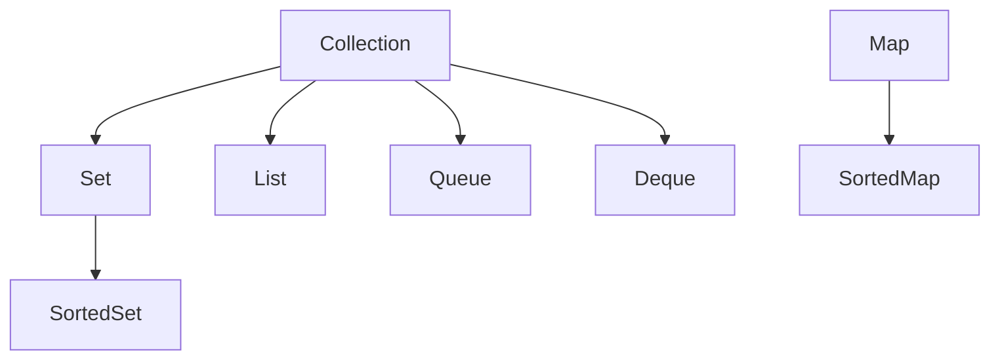

---
aliases:
  - Containers
---
A Collection--sometimes called Containers--is an object that groups multiple elements into a single unit. Collections allow the storage, retrieval, manipulation, and communication of aggregate data (data that is collected and processed throughout the entire collection).

Typically, collections represent data items that form a natural group e.g. Telephone directories, Contacts, Shopping Cart, Classroom, etc.

The hierarchy of a Java Collection is as such:


> [!note] Note
>  Holy fuck I love `mermaid.js`
## Queue
A queue is a special collection that takes on the idea of (surprise surprise) a fucking queue.

A queue has a Front and a Rear. Objects are added to the queue from the Rear, but are retrieved from the queue from the Front. This operation is called [[FIFO]]--First In, First Out.

An object can only appear in 1 queue once (no repeats).
## Deque
Double-Ended Queue (holy shit this naming convention sucks). Basically a queue but you can insert/retrieve from both ends of the queue.
## List
Chronological Collection where every object is connected to each other through a specific characteristic--the "next" relationship and the "prev" relationship.

An object can be added to the List from anywhere, as long as the next and prev values are valid.  

An object can appear multiple times in a List.

When doing a search, the search will be looking for the first instance or all instances, rather than one specific element.
### ArrayList\<E\>
An ArrayList is a List implemented in the format of an Array. Very cringe, works like absolute slog, and is too widely used for its own good. 

Use by importing `java.util.ArrayList`. Initialize by using 
```Java
ArrayList<E> someListName = new ArrayList<E>();
```

`E` here is the type of each individual element included in the ArrayList.  
## Map
Key-value pair that maps one value from the set S to a value in the set T. In our case, S is the name, and T is the value of S assuming you mapped it. Example: "studentA": "3.0GPA". 

Keys are unique, values can be duped.
## Set
Unordered Collection, does not allow duplicate elements, kinda like the [[Set (Math)|Set]] in Math.